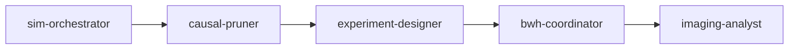
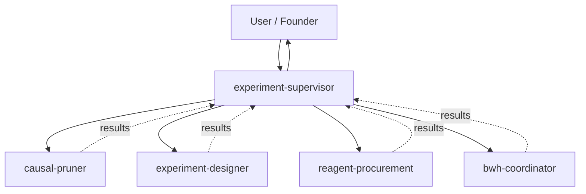
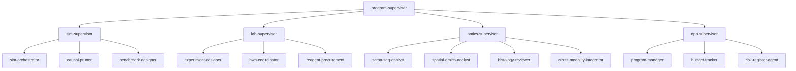
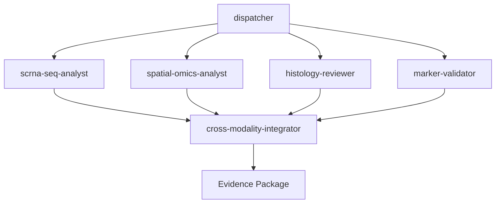
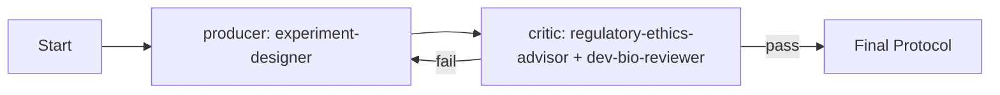
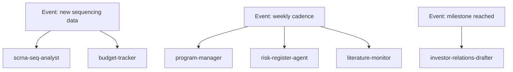

# Orchestration Patterns

> **When to read this file:** When designing the system architecture (Phase 2 of the SKILL.md pipeline) and choosing how agents will be wired together. Each pattern below has Organogenesis-specific worked examples so you can pattern-match quickly.

The pattern is the *spine* of the agent system. Get it wrong and even good individual agents will produce inconsistent, slow, or contradictory output. The right pattern depends on three things: **how data flows** (sequential, parallel, branching), **whether a human is in the loop**, and **how often the system iterates** (one-shot vs. loops).

---

## Pattern 1 — Pipeline (Sequential)

**Shape:** A → B → C → D. Each stage's output is the next stage's input. No branching, no parallelism, no loops.

**Use when:**
- The workflow has a strict order (you can't analyze samples before they exist).
- Each stage transforms the previous stage's output and there's nothing useful to do in parallel.
- You want a simple, debuggable system.

**Avoid when:**
- Stages can run in parallel (you're leaving throughput on the table).
- You need to iterate (a loop pattern fits better).
- The output of one stage often invalidates earlier work (you need a refinement loop).

**Mermaid:**

**Organogenesis example:**
*Confirmatory analytics on a finalist sample.*
- `sample-receiver` (logs sample) → `scrna-seq-analyst` → `spatial-omics-analyst` → `histology-reviewer` → `cross-modality-integrator`.
- One sample in, one evidence package out. No reason to go fancy.

**Skill ecosystem realization:**
Each stage is a sub-skill. A thin orchestrator skill (or even just a slash command in a "lab-pipeline" skill) calls them in order, passing artifacts via filenames in shared storage.

---

## Pattern 2 — Supervisor (Router + Specialists)

**Shape:** A central supervisor agent receives the task, decides which specialist(s) to invoke, dispatches, collects results, and returns to the user. Specialists don't know about each other.

**Use when:**
- The task type isn't known up front — the supervisor decides.
- A human-in-the-loop wants to review each specialist's output before the next is dispatched.
- You want one consistent "front door" for a complex domain.

**Avoid when:**
- The task path is fixed (a pipeline is simpler).
- The supervisor becomes a bottleneck or rewrites everything (then it's no longer a supervisor — it's a monolith).

**Mermaid:**

**Organogenesis example:**
*"Plan the next round of experiments based on this week's pruning results."*
- `experiment-supervisor` reads pruning results, decides to invoke `experiment-designer` (for the protocol), `reagent-procurement` (to check reagent availability), and `bwh-coordinator` (to check lab capacity), then synthesizes a go/no-go recommendation back to the founder-scientist.

**Skill ecosystem realization:**
- The supervisor is an orchestrator skill whose SKILL.md says: "When triggered, invoke skills X, Y, Z in this order/conditionally, and synthesize."
- Sub-skills are independent and don't know about the supervisor.
- The supervisor's role spec must list sub-skills explicitly and define dispatch logic.

---

## Pattern 3 — Hierarchical (Tree of Supervisors)

**Shape:** A top-level supervisor delegates to sub-supervisors, each with their own specialists. Like an org chart.

**Use when:**
- The system has 10+ agents and you need clean separation between sub-domains.
- Different sub-systems have different cadences (e.g., daily ops vs. weekly omics review).
- A single supervisor would become a 1000-line SKILL.md.

**Avoid when:**
- The system has fewer than ~8 agents (a flat supervisor is simpler).
- Sub-domains need to constantly cross-talk (hierarchies hide that traffic).

**Mermaid:**

**Organogenesis example:**
*Phase I full system.*
- Top: `program-supervisor`
- Mid: `sim-supervisor`, `lab-supervisor`, `omics-supervisor`, `ops-supervisor`
- Leaves: the 12-14 specialist agents from `agent-catalog.md`.

**Skill ecosystem realization:**
- Each supervisor is its own orchestrator skill.
- The top supervisor's SKILL.md describes when to route to each mid-level supervisor.
- Mid-level supervisors describe when to invoke their leaves.
- Leaves are independent specialist skills.
- This is the recommended structure for the full Phase I system.

---

## Pattern 4 — Parallel + Aggregator

**Shape:** A dispatcher launches N agents in parallel on the same or related tasks. An aggregator collects their outputs and synthesizes.

**Use when:**
- The same input can be analyzed multiple ways simultaneously (omics + imaging + histology on one sample).
- You want a "second opinion" or ensemble effect.
- Throughput matters and stages don't depend on each other.

**Avoid when:**
- The agents would step on each other's outputs.
- You don't have the compute or rate-limit headroom.

**Mermaid:**

**Organogenesis example:**
*Per-sample evidence package generation.*
- All four modality analysts run in parallel on the same finalist sample. `cross-modality-integrator` waits for all four, then produces the gate scorecard.

**Skill ecosystem realization:**
- Today, Claude Skills don't natively run in parallel within one chat — but the *pattern* still applies: the orchestrator skill describes the conceptual parallelism, and downstream automation (n8n, Claude Agent SDK, code execution) actually runs them in parallel.
- For a single Claude.ai chat, the pattern degrades gracefully to sequential execution with the orchestrator iterating through analysts.

---

## Pattern 5 — Iterative Refinement (Producer + Critic)

**Shape:** A producer generates a draft. A critic reviews it. The producer revises. Loop until quality threshold met or iteration cap hit.

**Use when:**
- Quality matters more than speed.
- The first draft is rarely the best.
- You can define explicit quality criteria.

**Avoid when:**
- The criteria for "good enough" are vague (you'll loop forever).
- Latency matters and one-shot quality is acceptable.

**Mermaid:**

**Organogenesis example:**
*Drafting a wet-lab protocol that must pass IACUC + dev-bio review.*
- `experiment-designer` drafts → `regulatory-ethics-advisor` checks IACUC/IBC/ISSCR compliance + a dev-bio reviewer agent checks biological plausibility → if either fails, sends notes back to `experiment-designer` to revise. Loop with a 3-iteration cap.

Another classic application: *Iterative pruning loop.*
- `causal-pruner` produces a candidate program → `sim-orchestrator` runs validation simulations → if program doesn't reproduce the target structure with parsimony, prune is rejected and pruner picks the next-most-informative ablation. This is the active-learning loop the project actually depends on.

**Skill ecosystem realization:**
- Producer and critic are separate skills.
- A thin loop-supervisor skill orchestrates the loop, holds the iteration count, and knows the "good enough" criterion.
- Always set an iteration cap. Always.

---

## Pattern 6 — Event-Driven / Reactive

**Shape:** Agents are triggered by events (file dropped, schedule fired, threshold crossed) rather than by an upstream agent's explicit handoff.

**Use when:**
- The system runs continuously, not just when a user asks.
- Multiple workflows share triggers (e.g., new sequencing data drops → analyze + alert + log).
- You want decoupling between producers and consumers.

**Avoid when:**
- The workflow is one-shot (overhead isn't worth it).
- You can't easily debug "why did this fire?"

**Mermaid:**

**Organogenesis example:**
*Weekly integrated review.*
- A weekly schedule event fires → `program-manager`, `risk-register-agent`, `budget-tracker`, `literature-monitor` all run independently → outputs land in a shared review doc → founder reviews on Friday.

**Skill ecosystem realization:**
- Pure Claude Skills are user-invoked, not event-driven, so this pattern usually requires an external scheduler (n8n, cron, Claude Agent SDK).
- Within Claude.ai, you can simulate event-driven by having a single "weekly-review" orchestrator skill that, when invoked, calls all the reactive sub-skills in sequence.

---

## Pattern 7 — Map-Reduce

**Shape:** Same task applied to many inputs in parallel (map), then results aggregated (reduce).

**Use when:**
- You have many similar items to process (e.g., 50 sample wells, 200 candidate intervention recipes).
- Each item is independent.

**Avoid when:**
- Items have dependencies on each other.
- The mapping step is trivially fast (overhead exceeds benefit).

**Organogenesis example:**
*Ranking all candidate intervention recipes from a pruning sweep.*
- Map: a scoring agent evaluates each candidate recipe against the same rubric.
- Reduce: a ranking agent sorts them, returns top-K.

This is often more naturally implemented as a code-execution loop *inside* a single agent rather than as separate skills, but the pattern is worth naming so you don't over-architect.

---

## Pattern 8 — Human-in-the-Loop Gate

**Shape:** A workflow runs autonomously until it hits a gate, then halts and waits for explicit human approval before continuing.

**Use when:**
- Stakes are high (committing budget, dispatching to a paid lab service, sending an investor update).
- Regulatory or ethical decisions need human accountability.
- You're early in trusting the system and want oversight.

**Avoid when:**
- The friction of the gate exceeds the value of oversight (don't gate trivial steps).

**Organogenesis example:**
*Pruning → wet-lab handoff.*
- `causal-pruner` produces a ranked recipe list → `experiment-designer` drafts the wet-lab protocol → **GATE: founder-scientist + dev-bio adviser approve** → `bwh-coordinator` schedules → `reagent-procurement` orders.

**Skill ecosystem realization:**
- The gate is a literal pause in the orchestrator skill: "Present the draft protocol to the user. Wait for explicit approval. Do not proceed without it."
- Combine with the supervisor pattern (the supervisor is the gate).

---

## Pattern Selection Cheatsheet

| If the workflow is... | Pattern |
|------------------------|---------|
| Strictly sequential, one-shot | Pipeline |
| Routed based on input type | Supervisor |
| Large enough that one supervisor is too much | Hierarchical |
| Same input analyzed multiple ways | Parallel + Aggregator |
| Quality-critical, draft-then-review | Iterative Refinement |
| Continuous / cadence-driven | Event-Driven |
| Same task on many items | Map-Reduce |
| Stakes are high or regulated | Human-in-the-Loop Gate |
| Output filtering before downstream consumption (Method 1) | **Composite Audit (NEW v2.2)** |

Most real systems combine 2-3 patterns. The Phase I full system, for example, is **Hierarchical** at the top, with **Iterative Refinement** inside the sim/pruning supervisor, **Parallel + Aggregator** inside the omics supervisor, **Pipeline** inside the lab supervisor, and **Human-in-the-Loop Gates** at the simulation→lab handoff and the milestone reporting points.

When you propose a pattern, **always justify why** in 2-3 sentences in the architecture output. "Pipeline because the omics confirmation has no useful parallelism in Phase I — sample volume is too low to justify the orchestration overhead." That's a real reason. "Supervisor because it's flexible" is not.

---

## Composite Audit Pattern (NEW v2.2)

*Replaces the naive single-LLM SI/NO auditor in Method 1 pipelines.*

**The problem.** A single-LLM auditor that filters specialist outputs in a Method 1 pipeline combines simultaneously the three worst-documented LLM problems (per April 30, 2026 stress-test):
1. Poor calibration (Vega et al. February 2025: ~30% off-target in biomedicine)
2. Questionable faithfulness (Anthropic April 2025: 25-39% honest declaration of influences)
3. Brittleness to perturbations (Mirzadeh October 2024 conclusion not refuted by 2025 work; Roh June 2025 confirmation)

As a cascade node in a Method 1 pipeline, the single-LLM auditor's errors propagate forward to subsequent stages (sim orchestrator, second auditor, second human gate). Each downstream stage assumes the upstream filter has worked.

**The pattern.** Replace the single-LLM auditor with a `composite-auditor` agent (see agent-catalog.md v2.2) that selects an audit method based on the type of output being audited. Three modes:

1. **Self-Consistency mandatory mode** — for outputs where a correct answer can be majority-voted. Run 5–7 instances of the audit judgment in parallel with temperature > 0. Report majority decision and agreement rate. If agreement < 70%, escalate to human gate without filtering.

2. **Logic-LM mandatory mode** — for outputs where criteria are formalizable (compliance: IACUC, ISSCR, IBC; budget; timeline; safety). Validation is symbolic, not LLM-based. Decisions are perfectly calibrated by construction.

3. **Human gate before auditor mode** — for outputs above an impact threshold. These outputs do not pass through automatic filtering — they go directly to a human reviewer.

The original single-LLM auditor reduces to a residual case: only operates on outputs where Self-Consistency does not apply, Logic-LM does not apply, and impact is low.

**When to use.**

This pattern is mandatory for any Method 1 pipeline that involves filtering before a human gate. It is recommended for any Method 2 pipeline where the human is doing strategic decision-making but wants automated quality checks on intermediate outputs.

**Skill ecosystem realization.**

- The composite-auditor agent is a single callable component with internal mode-selection logic.
- The Self-Consistency mode requires multiple parallel calls to the same model — no new infrastructure.
- The Logic-LM mode requires a Python solver dependency (Z3 recommended).
- The human gate mode signals existing human-review queues — no new infrastructure.

**Architectural implication.**

With composite-auditor in place, Method 1 becomes structurally safer to deploy. However, per method-selection.md v1.1, Method 1 still operates as a minority case in Phase I. The composite-auditor enables Method 1 to scale safely later, when substrate evidence justifies expansion.
